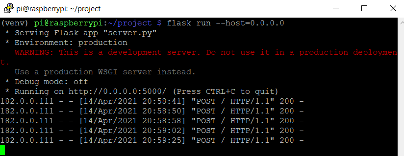
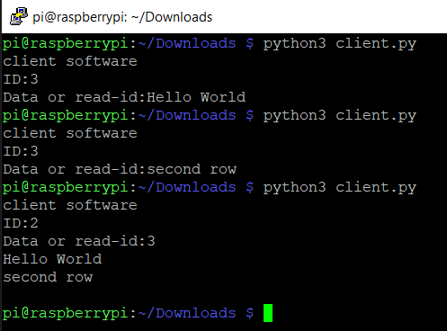

# pythonHTTPclient-server
Dieses Repository beinhaltet Python Code für Server-/Clientverbindungen.

### Clients (Strings senden)
  Mehrere Clients (jeder mit einer eigenen eindeutigen ID) senden 
  Nachrichten über HTTP and einen Server (HTTP-POST).

Die Nachrichten sind einfache Strings + die ID.

### Server
Der Server loggt die Nachrichten in einem File.
Jedem Client ist ein eigenes File zugeordnet, dem eine neue Zeile hinzugefügt wird, sobald 
eine Nachricht ankommt.

### Clients (Strings empfangen)
Ein weiterer Client kann die Files anfragen.
In meinem Beispiel ist dies der Client mit der ID=2.
Dies kann im Server-Code, in einer globalen Variablen, geändert werden.

Als String wird die Client Nummer angegeben, von welchem man das File lesen möchte!
 
## Info
Erstmal nur normales (unverschlüsseltes) HTTP.

Papers:

-Clients:
https://docs.python-requests.org/en/master/
 
-Server:
https://flask.palletsprojects.com/en/1.1.x/

Server                     | Client 
:-------------------------:|:-------------------------:
  |  
